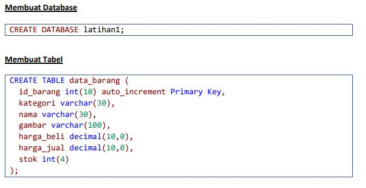
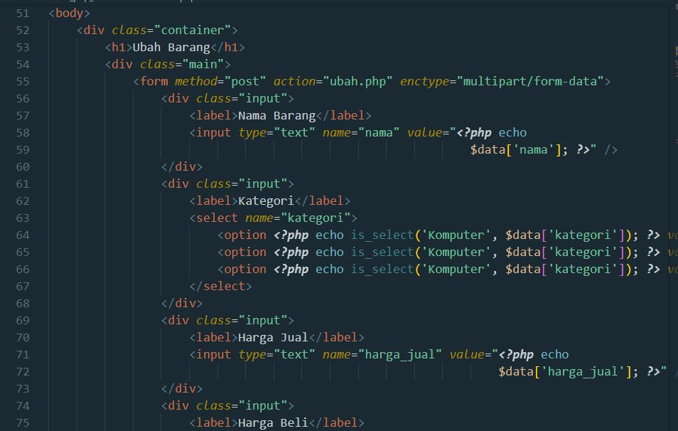

# Lab3Web

<h3>Biodata Mahasiswa</h3>           
    <table>
        
<tr>
               <td>Kelas</td>
               <td>:</td>
               <td>TI.21.A.1</td>
               <td>&nbsp;</td>
       </tr>

       
<tr>
               <td>Nama</td>
               <td>:</td>
               <td>M. AKMAL AL ABDILAH</td>
               <td>&nbsp;</td>
       </tr>

       
<tr>
               <td>Nim</td>
               <td>:</td>
               <td>312110034</td>
               <td>&nbsp;</td>
       </tr>

       </table>

Assalam'mulaikum wr wb. 
 

Di tugas pratikum kali ini saya akan membagikan sedikit shering mengenai program php d  dasar CRUD menggunakan PHP dan xampp database, tanpa berlama lama lagi saya kan mesering foto hasil output dari coding hapus.php, index.php, koneksi.php, style.css, tambah.php, ubah php yang di jadikan satu kedalam file polder lab_3_phpdatabase  di bawah ini adalah poto gambarnnya.

# Tugas_Pratikum_3

Tampilan program di dekstop(komputer)

 

Pasti kalian penasaran bagaimana cara membuatnya saya akan menjelaskan setep by stepnya, jadi bacalah sampai habis.

1. Membuat database

Coding databasenya.

Bagaimana cara memasukan coding databasenya pertama kalian install, xampp setelah itu kalian buka phpmyadmin di browser atau kalian bisa mengikuti langkah seperti gambar berikut di bawah ini.

jika sudah kalian bisa mengklik gambar impor dan imporlah file latihan1.sql di file lab3_ph_database, jika kalin tidak mau ribet jika kalian mau belajar dari no kalian bisa mengikuti langkah-langkah berikut.

a. carilah kolom di menu data base tulis latihan1

b. pasukan code yang ada di poto atas coding database di menu SQL

c. setelah itu kalian sudah punya databasenya

mukin penjelasan saya kurang dapat di mengerti kalian bisa mencari lagi di tempat lain

2. Membuat polderbaru di menu xampp/htdocs/lab3_php_database

3. Kalian bisa pindahkan file lab3_php_database di atas jika memang ga mau repot tapi saya akan jelsakan sedikit.

a. file index.php

File ini memiliki beberapa fungsi penting, antara lain:
Menampilkan halaman utama website: File index.php berfungsi sebagai halaman utama atau landing page dari sebuah website. Ketika sebuah domain diakses, server akan mencari file index.php sebagai halaman pertama yang ditampilkan.

berikut di bawah ini adalah koding yang ada di file index.php

b. file koneksi.php

File koneksi.php adalah file yang berfungsi untuk melakukan koneksi antara website dengan database, Membuka koneksi ke database: File koneksi.php berisi kode-kode yang digunakan untuk membuat koneksi antara website dengan database.

berikut di bawah ini adalah koding yang ada di file koneksi.php

c.file tambah.php

Menampilkan form input data: File tambah.php berfungsi untuk menampilkan form input data yang akan ditambahkan ke dalam tabel database. Form tersebut biasanya berisi field-field yang sesuai dengan kolom-kolom di dalam tabel database.

berikut di bawah ini adalah koding yang ada di file tambah.php

d. file ubah.php

Menampilkan form edit data: File ubah.php berfungsi untuk menampilkan form edit data yang sudah tersimpan di dalam tabel database. Form tersebut biasanya berisi field-field yang sesuai dengan kolom-kolom di dalam tabel database.

berikut di bawah ini adalah koding yang ada di file ubah.php

e. file hapus.php

Mengambil data yang akan dihapus: File hapus.php akan mengambil data yang akan dihapus dari tabel database, berdasarkan id atau primary key yang diberikan oleh pengguna.

berikut di bawah ini adalah koding yang ada di file hapus.php

f. file style.css

Mendefinisikan tampilan elemen HTML: File style.css digunakan untuk mendefinisikan tampilan atau styling elemen HTML seperti warna, ukuran, jenis font, dan posisi.

berikut di bawah ini adalah koding yang ada di file style.css

Oke terima kasih telah membaca hingga titik ini saya mohon maaf apabila kurang bisa menjelaskan lebit terperinci lagi sampai ketemu lagi assalam'mulaikum wr. wb.
